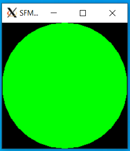

### SFML Testing Tutorials
C++ SFML Testing

For window, need to setup sfml correctly by building and installing to system.
1. `git clone --branch 2.6.x https://github.com/SFML/SFML.git`
    - the master branch is the working development branch for the SFML project considered unstable for SFML 3
    - the 2.6.x branch is the nearly complete next minor version SFML 2.6 and should be stable
2. `cd SFML`
3. `mkdir build && cd build/`
4. `cmake ..`
    - make sure cmake is installed and available to use on your system
5. use `ccmake .` and turn on settings for (optional)
    - `SFML_BUILD_DOC`
    - `SFML_BUILD_EXAMPLES`
    - `SFML_BUILD_TEST_SUIT`
    and press `c` to configure/update `CMakeCache.txt`
6. Make sure dependencies are installed (development versions required)
    - `freetype` :
        Library used for font operations such as rendering text onto bitmaps
    - `x11` :
        Windowing system that provides the basic framework for a GUI environment
    - `xrandr` :
        Utility used to set the size, orientation or reflection of the outputs for a screen
    - `udev` :
        Device manager for the Linux kernel
    - `opengl` :
        Cross-platform API for rendering 2D and 3D graphics
    - `flac` :
        Audio coding format for lossless compression of digital audio
    - `ogg` :
        Open container format providing efficient streaming and manipulation of digital multimedia
    - `vorbis` :
        Audio coding format and software reference encoder/decoder for lossy audio compression
    - `vorbisenc`, `vorbisfile` :
        Libraries for encoding audio in Vorbis format
    - `openal` :
        Cross-platform audio API that uses coding conventions similar to OpenGL
    - `pthread` :
        C library for managing threads. Provides API to perform multithreading
7. `make` (optional check that SFML compiles)
8. `sudo make install`
    - the SFML components will be copied to install locations specified in the `CMakeCache.txt` file

Producing first window
- initially saved in the master branch
- with cmake and SFML properly installed, this repository can be used to produce the first window
1. `git clone git@github.com:terrill37/basicSFML.git sfmlSample`
2. `cd sfmlSample`
3. `mkdir build && cd build`
4. `cmake ..`
5. `make`
    - will produce the executable as listed in the `CMakeLists.txt` file
6. `./gameEngine` (name will probably change in upcoming update)
    - will draw window with green circle for master branch
    
